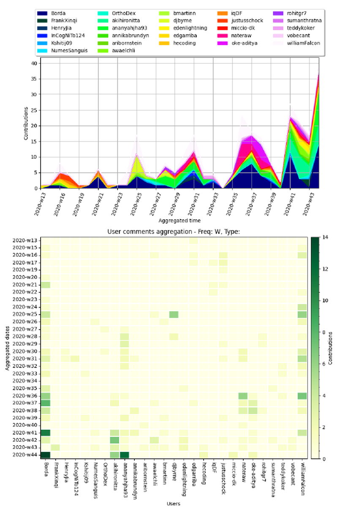

# Repository Stats

[](https://github.com/Borda/pyRepoStats/actions/workflows/ci_testing.yml)
[](https://codecov.io/gh/Borda/pyRepoStats)
[](https://www.codefactor.io/repository/github/borda/pyrepostats)
[](https://results.pre-commit.ci/latest/github/Borda/pyRepoStats/main)

This simple tool aims on open-source projects providing simple repository stats which are a bit out of scope of base Git and need some more information about issues and PRs.

### Highlighted features

- cumulative **caching** (no need to full download, just incremental/needed update)
- collection of **overall user contributions** to issues/PRs
- visualization of **aggregated timeline** of past contributions

## Installation

Simple install with setuptools/pip as

```bash
pip install https://github.com/Borda/pyRepoStats/archive/main.zip
```

or after cloning the repository

```bash
python setup.py install
```

## Sample usage

The CLI provides two commands: **`scrape`** (fetch data from GitHub) and **`analyze`** (analyze cached data).

### Basic command structure

```bash
# General format
repostat <command> <repository> [options]

# Or using python -m
python -m repo_stats <command> <repository> [options]
```

### Available commands

1. **`scrape`** - Fetch repository data from GitHub (always requires internet connection)
2. **`analyze`** - Analyze previously fetched data (works offline by default)

### Examples

- If you just clone this repo without installation, you need to install dependencies and call script:
  ```bash
  pip install -r requirements.txt
  python src/repo_stats/__main__.py scrape PyTorchLightning/pytorch-lightning-bolts
  ```
  
- If you have already installed the package with `pip` or with `setup.py` you can call the executable:
  ```bash
  # Scrape (fetch) data from GitHub
  repostat scrape PyTorchLightning/pytorch-lightning-bolts --auth_token <your-personal-token>
  
  # Analyze the scraped data
  repostat analyze PyTorchLightning/pytorch-lightning-bolts --users_summary+ "all"
  ```
  
- Or use package with a pythonic way:
  ```bash
  # Scrape data
  python -m repo_stats scrape PyTorchLightning/pytorch-lightning-bolts
  
  # Analyze data
  python -m repo_stats analyze PyTorchLightning/pytorch-lightning-bolts --min_contribution 5
  ```
  
**Note:** When using `python -m repo_stats`, consider passing `--output_path` argument for output path, otherwise all caches and results will be saved in installation folder, most likely _site-packages_

To simplify the token passing in each call, you can export the token to environment variables `export GH_API_TOKEN=<your-personal-token>` for Github.

### Github use-case

For GitHub users we recommend using your personal GitHub token which significantly increases [request limit](https://developer.github.com/v3/#rate-limiting) per hour.

### Command-specific options

Use `--help` to see all available options for each command:
```bash
# See all commands
python -m repo_stats --help

# See options for scrape command
python -m repo_stats scrape --help

# See options for analyze command  
python -m repo_stats analyze --help
```

#### Analyze command options

The `analyze` command provides various options for visualizing and summarizing repository data:

- **User summary table**: Use `--users_summary+ "merged PRs" --users_summary+ "commented PRs" --users_summary+ "opened issues" --users_summary+ "commented issues"` where the first column is used for sorting rows with users:

  Example command:
  ```bash
  repostat analyze Borda/pyRepoStats --users_summary+ "merged PRs" --users_summary+ "opened issues"
  ```

  | user                                              | merged PRs | commented PRs | opened issues | commented issues |
  | :------------------------------------------------ | ---------: | ------------: | ------------: | ---------------: |
  | [williamFalcon](https://github.com/williamFalcon) |         74 |            21 |            14 |                8 |
  | [Borda](https://github.com/Borda)                 |         42 |            35 |             4 |               18 |
  | [akihironitta](https://github.com/akihironitta)   |         17 |             1 |             5 |                5 |
  | [ananyahjha93](https://github.com/ananyahjha93)   |         14 |             2 |             6 |               21 |
  | [annikabrundyn](https://github.com/annikabrundyn) |         12 |             0 |             0 |                2 |
  | [djbyrne](https://github.com/djbyrne)             |         11 |             2 |             4 |                4 |
  | [nateraw](https://github.com/nateraw)             |          9 |             1 |             6 |                8 |
  | [teddykoker](https://github.com/teddykoker)       |          3 |             2 |             0 |                0 |

- **Contribution filter**: Use `--min_contribution N` to filter users by minimum number of contributions:
  ```bash
  repostat analyze Borda/pyRepoStats --min_contribution 10 --users_summary+ "all"
  ```

- **Time frame filtering**: Define a time frame with `--date_from` and `--date_to` for filtering events - created issues, merged PRs and comments/reviews:
  ```bash
  repostat analyze Borda/pyRepoStats --date_from "2023-01-01" --date_to "2023-12-31"
  ```

- **Contribution aggregation over time**: Use `--user_comments+` with time granularity (D=Day, W=Week, M=Month, Y=Year) to visualize contribution patterns:
  ```bash
  # Weekly aggregation
  repostat analyze Borda/pyRepoStats --user_comments+ W
  
  # Weekly aggregation for issues and PRs separately
  repostat analyze Borda/pyRepoStats --user_comments+ W --user_comments+ issue --user_comments+ pr
  
  # Multiple time sampling (weekly and monthly)
  repostat analyze Borda/pyRepoStats --user_comments+ W --user_comments+ M
  ```
  
  This draws double charts: (a) cumulative aggregation over all users and (b) heatmap-like image with time on Y-axis and users on X-axis.

  

To deny showing figures set environment variable `export SHOW_FIGURES=0`.

## Contribution

Any help or suggestions are welcome, pls use Issues :\]
